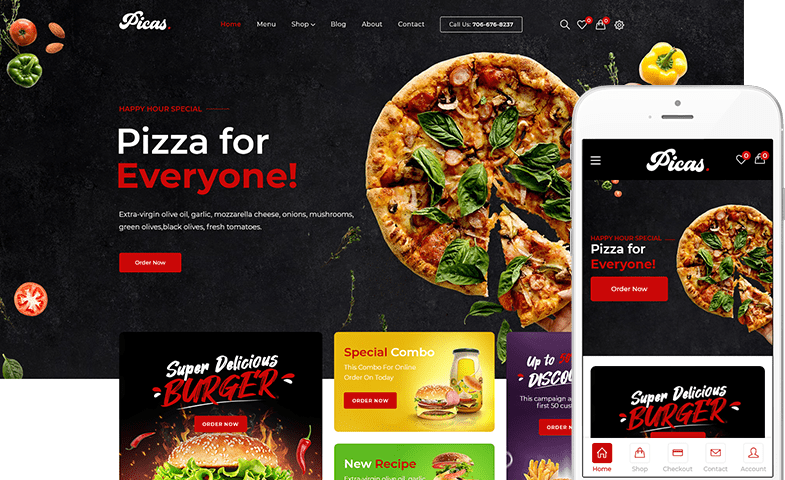

# django_ecommerce



♨️ **Note:** This project was created by MR. Ely and is currently under active development.🍃


## Overview

This Django-based e-commerce web application, named "django_ecommerce", is a powerful and versatile solution for online retail businesses. It provides a feature-rich platform for both customers and administrators, facilitating efficient product management, secure transactions, and a seamless shopping experience.

With django_ecommerce, customers can explore a wide range of products, create accounts, manage their profiles, and complete purchases securely. Meanwhile, administrators have access to an intuitive admin panel for product catalog management, order processing, and customer relationship management.

## Table of Contents

- [Installation](#installation)
- [Usage](#usage)
- [Features](#features)
- [Technologies Used](#technologies-used)
- [Contributing](#contributing)
- [License](#license)
- [Screenshots](#screenshots)


## Installation

1. **Clone the repository:**

```shell
  https://github.com/mr-ely-git/django_ecommerce.git
```


2. **Navigate to the project directory:**

```shell
  cd django_ecommerce

```
3. **Create a virtual environment and activate it:**

```shell
  python -m venv venv
  source venv/bin/activate  # On Windows, use 'venv\Scripts\activate'
```

4. **Install project dependencies:**

```shell
  pip install -r requirements.txt

```

5. **Create a *.env* file and configure environment variables (see *.env.example* for reference).**
6. **Apply database migrations:**
```shell
  python manage.py migrate

```
7. **Create a superuser account:**

```shell
  python manage.py createsuperuser

```

8. **Start the development server:**

```shell
  python manage.py runserver

```
9. **Access the admin panel at *http://localhost:8000/admin/* and log in with your *superuser* credentials.**


## Usage

1. Browse the website at http://localhost:8000/ to view products and make purchases.
2. Use the admin panel to manage products, orders, and customer data efficiently.

## Features

- User Authentication: Allows customers to register, log in, and manage their profiles.
- Product Catalog: Displays products with details, pricing, and images.
- Shopping Cart: Enables users to add and remove items from their carts.
- Order Management: Tracks order history and status for both customers and administrators.
- Secure Payment Processing: Integrates payment gateways for secure transactions (e.g., PayPal, ...).
- Admin Panel: Offers an easy-to-use interface for managing products, orders, and customer data.

## Technologies Used

- Django: A high-level Python web framework for rapid development.
- PostgreSQL: A powerful, open-source relational database.
- HTML, CSS, JavaScript: Front-end technologies for a responsive and interactive user interface.
- Bootstrap: A CSS framework for building responsive and visually appealing designs.
- Other dependencies (see requirements.txt for details).

## Contributing

**Contributions are welcome! 👋 Please follow these steps to contribute:**

- Fork the repository.
- Create a new branch for your feature or bug fix:
```shell
  git checkout -b feature/your-feature
```
- Commit your changes:

```shell
  git commit -m "Add your feature"
```

- Push to the branch:

```shell
  git push origin feature/your-feature
```

- Open a pull request.


## License
This project is licensed under the License Name | see the LICENSE.md file for details.

## Screenshots

   
